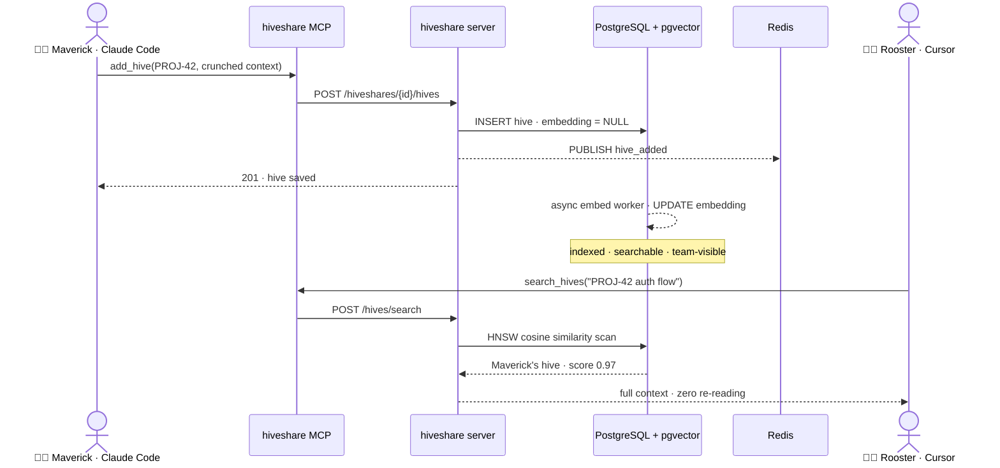

# HiveShare

**Collaborative AI memory for engineering teams.**

When you and your teammates use Claude Code or Cursor on the same Jira ticket or GitHub issue, every session re-crunches the same context from scratch. HiveShare fixes that: anything one person's AI agent processes gets stored as searchable memory in a shared **hiveshare**, so everyone else's agent reuses it immediately — no re-reading, no re-summarising.



---

## Features

- **Isolated hiveshares** — one per project, story, or sprint; fully separate hive stores
- **Invite by email** — token-based, no SMTP required; teammates get their own API key on accept
- **Live sync** — `hshare stream` shows new entries from any teammate in real time (SSE; one Redis sub per hiveshare)
- **Semantic search** — OpenAI or Ollama embeddings (async on write, HNSW index); falls back to PostgreSQL full-text if not configured
- **MCP integration** — Claude Code and Cursor can search and save memory automatically without you doing anything
- **Metrics** — reuse rate, top contributors, source coverage, 7-day activity
- **Unique source refs** — one hive per `source_ref` per hiveshare; duplicates are auto-suffixed (`PROJ-42-2`) so saves never conflict
- **Hive deletion** — write-access members can delete any hive; Redis view counters are cleaned up and a `hive_deleted` event is broadcast over SSE
- **Hardened API** — hashed API keys, rate limits, body size cap, request timeouts, `GET /health`

---

## Quick start

### 1 — Start the server (Docker)

```bash
curl -O https://raw.githubusercontent.com/KB-perByte/hiveshare/main/docker-compose.full.yml
curl -O https://raw.githubusercontent.com/KB-perByte/hiveshare/main/.env.example
cp .env.example .env
# Edit .env: set a strong POSTGRES_PASSWORD and your BASE_URL
nano .env

docker compose -f docker-compose.full.yml up -d
```

The server is now running at `http://localhost:8080` (or your `BASE_URL`).

### 2 — Install the CLI

```bash
curl -sSL https://raw.githubusercontent.com/KB-perByte/hiveshare/main/install.sh | bash
```

Or with Go installed:

```bash
go install github.com/KB-perByte/hiveshare/cmd/hshare@latest
```

### 3 — Register and create a hiveshare

```bash
hshare auth register --email you@example.com --name "Maverick"
# Prints your API key once and saves it to ~/.config/hiveshare/config.json
# (server stores only SHA-256 of the key — save it now)

hshare hiveshare create "PROJ-42 Sprint"
hshare hiveshare list          # note the ID
hshare hiveshare use <uuid>
```

### 4 — Invite a teammate

```bash
hshare invite bob@example.com
# Prints an invite link:
#   https://your-server/api/v1/invitations/<token>/accept
```

Rooster opens the link (or POSTs to it), gets his API key, and runs step 2–3 with the same server URL.

### 5 — Connect Claude Code

Install the MCP binary:
```bash
go install github.com/KB-perByte/hiveshare/cmd/hiveshare-mcp@latest
# or: the install.sh above already placed it in ~/.local/bin/
```

Add to `~/.claude/claude_desktop_config.json`:
```json
{
  "mcpServers": {
    "hiveshare": {
      "command": "hiveshare-mcp",
      "env": {
        "HIVESHARE_API_KEY": "hvs_your_key",
        "HIVESHARE_SERVER_URL": "https://your-server",
        "HIVESHARE_DEFAULT_HEADSPACE": "your-hiveshare-uuid"
      }
    }
  }
}
```

Restart Claude Code. Claude now has five tools: `search_hives`, `add_hive`, `list_hiveshares`, `get_context`, `get_metrics`.

### 6 — Test it

**Maverick's terminal:**
```bash
hshare stream          # live tail — keep this open
```

**Rooster saves a hive:**
```bash
echo "PROJ-42: the JWT middleware needs to validate tokens before forwarding..." | \
  hshare hive add --source-type jira --source-ref PROJ-42 --tool claude
```

Maverick's terminal immediately shows:
```
[10:41:02] + hive added: jira/PROJ-42 by Rooster
```

**Maverick searches:**
```bash
hshare hive search "JWT validation"
```

---

## CLI reference

```
hshare auth register --email EMAIL --name NAME [--server URL]
hshare auth status

hshare hiveshare create NAME [--description TEXT]
hshare hiveshare list
hshare hiveshare use ID

hshare hive add --source-ref REF [--source-type TYPE] [--tool TOOL] [< file]
hshare hive search QUERY [--limit N] [--source-type TYPE]
hshare hive list [--source-type TYPE] [--limit N]

hshare invite EMAIL [--role all|view]
hshare members list

hshare stream
hshare metrics [--me]
```

Source types: `jira`, `github_issue`, `github_pr`, `file`, `url`, `manual`  
Tools: `claude`, `cursor`, `manual`  
Roles: `all` (invite + read + write memory) · `view` (read-only)

---

## MCP tools

| Tool | What it does |
|---|---|
| `search_hives` | Semantic or full-text search across the hiveshare |
| `add_hive` | Save crunched context (call after processing any ticket or PR) |
| `list_hiveshares` | List all spaces you belong to |
| `get_context` | All hives for a specific source ref (e.g. `PROJ-42`) |
| `get_metrics` | Collaboration stats for the hiveshare |

---

## Server configuration

| Variable | Default | Description |
|---|---|---|
| `DATABASE_URL` | — | Full Postgres DSN (overrides individual vars) |
| `POSTGRES_*` | see `.env.example` | Individual DB connection settings |
| `REDIS_URL` | `redis://localhost:6379` | Redis connection URL |
| `LISTEN_ADDR` | `:8080` | HTTP listen address |
| `BASE_URL` | `http://localhost:8080` | Public URL (used in invite links) |
| `EMBED_PROVIDER` | — | `openai` or `ollama`; empty = full-text search only |
| `OPENAI_API_KEY` | — | Required when `EMBED_PROVIDER=openai` |
| `OPENAI_EMBED_MODEL` | `text-embedding-3-small` | |
| `OLLAMA_BASE_URL` | `http://localhost:11434` | Required when `EMBED_PROVIDER=ollama` |
| `OLLAMA_EMBED_MODEL` | `nomic-embed-text` | |

---

## Architecture

```
hshare CLI  ──┐
               ├──  REST + SSE  ──  hiveshare-server (Go)
MCP sidecar ──┘                    │  embed workers, health
                            ┌──────┴──────┐
                      PostgreSQL      Redis
                     + pgvector      pub/sub + view counters
                        HNSW
```

- Auth: Bearer `hvs_…` key; **SHA-256 at rest**, cleartext returned only at registration
- Writes: hive inserts immediately; embeddings filled async (search uses full-text until ready)
- `source_ref` is unique per hiveshare — the API auto-suffixes duplicates (`PROJ-42-2`)
- Delete: removes the DB row, Redis view counter, logs a usage event, and publishes `hive_deleted` over SSE
- List endpoints omit full `content` (use Get/Search for body text)
- Ops: `GET /health` checks Postgres + Redis

See [`docs/ARCHITECTURE.md`](docs/ARCHITECTURE.md) for diagrams, scale analysis, and the V2/V3 roadmap. See [`docs/INFRA_SETUP.md`](docs/INFRA_SETUP.md) for ngrok, AWS EC2, and OpenShift deployment guides. See [`docs/DEMO.md`](docs/DEMO.md) for a full EC2 + Fedora + Mac two-person demo script (all CLI commands).

---

## Building from source

Requires Go 1.22+.

```bash
git clone https://github.com/KB-perByte/hiveshare
cd hiveshare
make deps build

# Binaries land in ./bin/
#   hiveshare-server  — API server
#   hiveshare-mcp     — MCP sidecar for Claude Code / Cursor
#   hshare            — CLI
```

### Development

```bash
# Start postgres + redis, run migrations, start server
make dev

# Or individually:
make docker-up
make migrate
./bin/hiveshare-server
```

---

## Infrastructure

Three deployment guides in [`docs/INFRA_SETUP.md`](docs/INFRA_SETUP.md):

| | ngrok | AWS EC2 | OpenShift |
|---|---|---|---|
| Setup | 5 min | 30 min | 45 min |
| Cost | Free | ~$8–10/mo | cluster cost |
| Best for | Quick two-person test | Ongoing team use | Enterprise / existing OCP |

OpenShift manifests are in [`deploy/openshift/`](deploy/openshift/).

---

## Contributing

Issues and PRs welcome. P0–P2 hardening is done; see [`docs/ARCHITECTURE.md`](docs/ARCHITECTURE.md) section 7 for remaining V2/V3 scale work.

---

## License

MIT — see [LICENSE](LICENSE).
