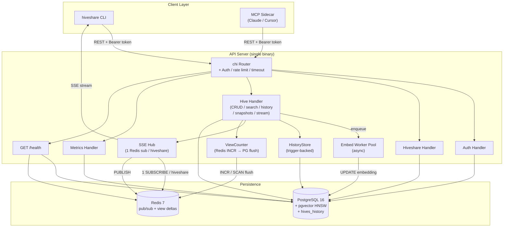
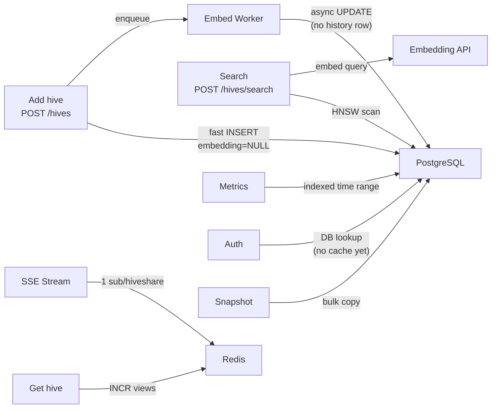
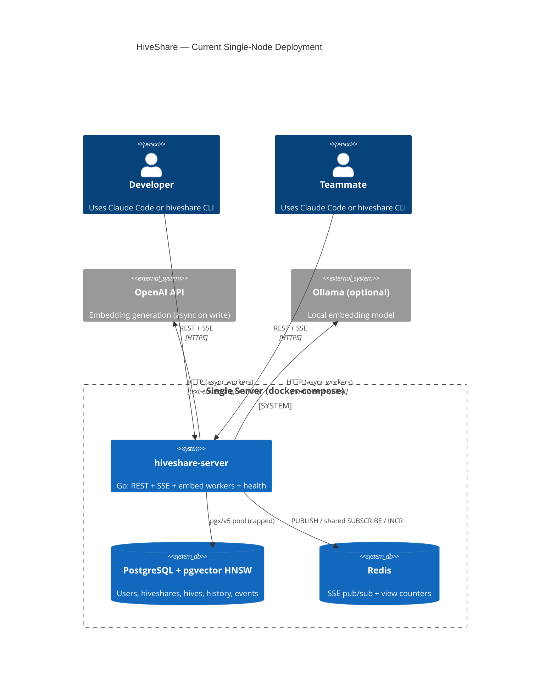
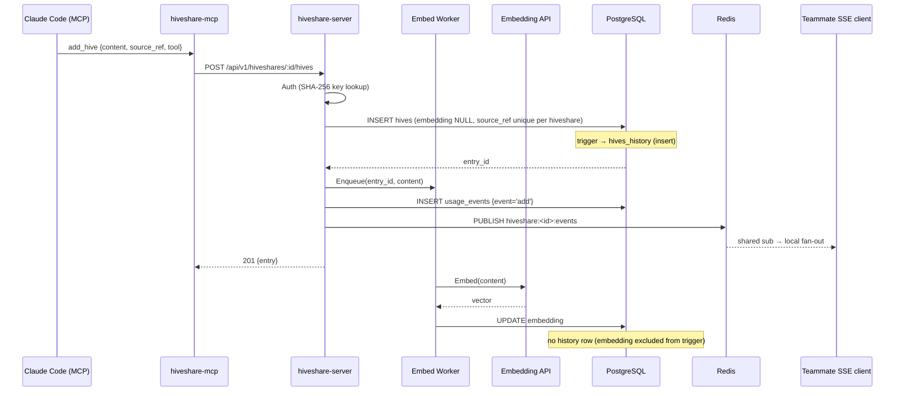
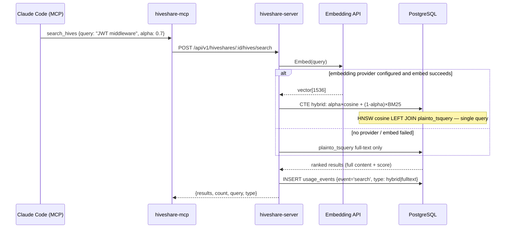
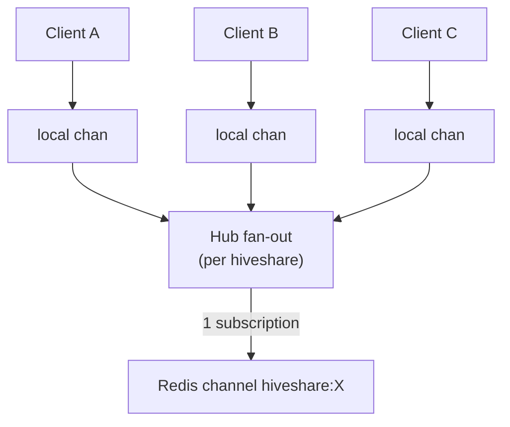
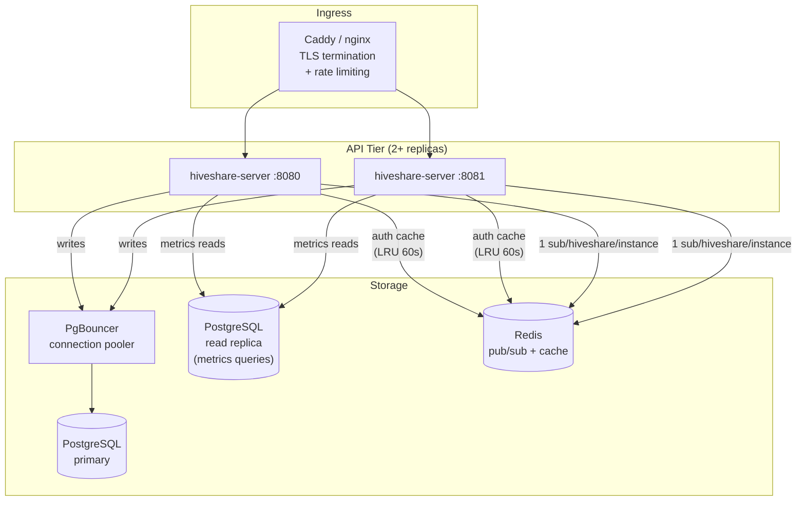
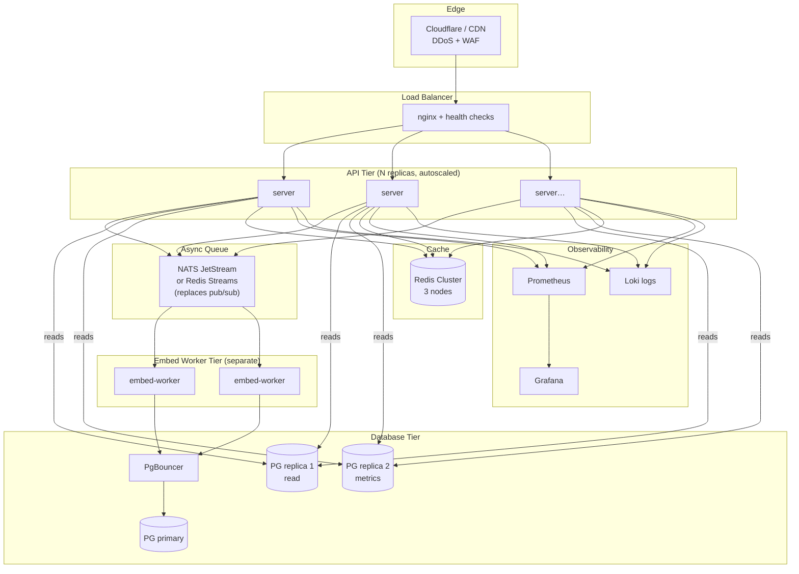

# HiveShare — Architecture

> **Status:** P0–P2 hardening from the initial review is **implemented**. This doc describes the as-built system, remaining scale work (V2/V3), and research notes.

---

## 1. Current Architecture (as-built)

### Component inventory

| Component | Implementation | File |
|---|---|---|
| HTTP router | chi v5 + httprate (per-endpoint: 10/min public by IP, 20/min writes, 30/min search, 200/min global), RequestSize 1MB, Timeout 30s (SSE excluded) | `internal/api/router.go` |
| Auth | Bearer API key; **SHA-256 at rest**, cleartext only at register | `internal/api/middleware.go`, `store/users.go` |
| DB pool | pgxpool MaxConns=20, MinConns=4, lifetimes set; `ivfflat.probes=10` AfterConnect | `internal/store/db.go` |
| Vector search | pgvector **HNSW** cosine | `migrations/002_indexes.sql`, `003_hardening.sql` |
| Search | **Hybrid**: BM25 (`ts_rank`) + cosine similarity blended by `alpha` (default 0.7). Falls back to full-text when no embedder configured. Response includes `"type": "hybrid"\|"fulltext"` | `internal/store/memory.go` (HiveStore) |
| Embedding | **Async** worker pool; HTTP path stores `embedding = NULL` then UPDATE | `internal/embed/worker.go` |
| History | Trigger on content/summary/tags/metadata (+ delete); rollback / undelete / copy | `migrations/006_hive_history.sql`, `store/history.go` |
| Snapshots | Point-in-time hiveshare capture; restore → **new** hiveshare (max 10k entries) | `store/history.go` |
| Real-time | One Redis sub per hiveshare → fan-out to local SSE clients | `internal/realtime/hub.go` |
| Views | Redis `INCR`, flush to Postgres every 60s | `internal/store/views.go` |
| usage_events TTL | Rolling delete > 90 days (daily job) | `cmd/server/main.go` |
| History retention | Optional `HISTORY_TTL_DAYS` / `HISTORY_MAX_VERSIONS` (default 0 = forever) | `cmd/server/main.go` |
| Health | `GET /health` — DB + Redis ping | `internal/api/router.go` |
| Logging | `slog` JSON | `cmd/server/main.go` |
| MCP server | stdio JSON-RPC; 10 tools; starts without API key (limited to `accept_invite`) for first-time onboarding | `internal/mcp/server.go` |
| MCP install scope | Binary global (`~/.local/bin`); credentials global (`~/.config/hiveshare/config.json`); default hiveshare **project-local** (`.claude/settings.json` via `hiveshare use --project`) | `cmd/hiveshare/main.go` |

---

## 2. Hardening status (P0–P2)

All items below were found in the initial review and are **fixed in tree**.

| # | Issue | Resolution |
|---|---|---|
| 2.1 | One Redis sub per SSE client | Shared sub per hiveshare; in-memory fan-out |
| 2.2 | Default pgxpool | Explicit Max/Min/lifetime config |
| 2.3 | ivfflat probes=1 | Migrated to **HNSW**; AfterConnect still sets probes for safety |
| 2.4 | Plaintext API keys | SHA-256 stored; cleartext returned once at registration |
| 2.5 | List returned full content | List omits `content`; Get/Search include it |
| 2.6 | Sync embed on POST | Buffered embed worker pool |
| 2.7 | Unbounded `usage_events` | 90-day purge + `created_at` index |
| 2.8 | Views UPDATE on every Get | Redis INCR + 60s Postgres flush |
| 2.9 | No rate limit | httprate 60 req/min per API key (or IP) |
| 2.10 | No body size cap | `RequestSize(1 << 20)` |
| 2.11 | No health endpoint | `GET /health` |
| 2.12 | Untyped `"userStore"` key | Typed `userStoreKey struct{}` |
| 2.13 | `log.Printf` | `slog` |
| 2.14 | No request timeout | 30s timeout; SSE route excluded |
| 2.15 | Invite expiry not in SQL | `status='pending' AND expires_at > NOW()` |
| 2.16 | `memory` renamed to `hive`; table `memory_entries` → `hives` | Migration 005; `source_ref` unique per hiveshare, API auto-suffixes duplicates |
| 2.17 | Delete ignored errors, left Redis view key, no SSE event | Returns 404 on not-found; cleans Redis key; publishes `hive_deleted`; logs usage event |
| 2.18 | No version history / snapshots | Migration 006: `hives_history` trigger, rollback/undelete/copy, snapshots (restore → new hiveshare) |
| 2.19 | Auth middleware DB round-trip per request | In-process LRU cache (256 entries, 60s TTL) in `AuthMiddleware` |
| 2.20 | `HiveStore.Get` returned HTTP 500 for missing hive | Fixed: returns `pgx.ErrNoRows` → 404 |
| 2.21 | `PUT /hives/{id}` silently zeroed content on partial update | Fixed: content required; validates before store call |
| 2.22 | Flat 60 req/min rate limit — no distinction by operation cost | Per-endpoint limits: 10/min public (by IP), 20/min writes, 30/min search, 200/min global |
| 2.23 | Binary vector-or-fulltext search choice | Hybrid CTE: `alpha × cosine + (1-alpha) × BM25`; `alpha` is per-request (default 0.7) |
| 2.24 | MCP had 5 tools, no onboarding path for new users | 10 tools; `accept_invite` works pre-API-key; server starts without key in limited mode |
| 2.25 | MCP default hiveshare was global-only | `hiveshare use --project` writes to `.claude/settings.json` — committable, teammates pick it up automatically |

**Ops note:** Existing plaintext API keys will not authenticate after the hash change — users must re-register (or accept a fresh invite). Apply migrations through `006_hive_history.sql` (`make migrate` or `scripts/install-server.sh`).

---

## 2.5 History & snapshots

Content mutations on `hives` are audited by a Postgres trigger (`record_hive_history`). The trigger fires on **INSERT**, **DELETE**, and **UPDATE OF content, summary, tags, metadata** — embedding-only updates from the async embed worker are excluded so history stays author-meaningful.

| Capability | Behaviour |
|---|---|
| List versions | `GET …/hives/{id}/history` |
| Rollback | Restores content fields from a history row; re-embeds if history embedding is NULL |
| Undelete | Re-inserts a deleted hive from its `delete` history row (`source_ref` auto-suffixed on conflict) |
| Copy | Copies hives into a target hiveshare; requires membership on the **source** |
| Snapshot | Copies all hives (incl. embeddings) for a hiveshare; rejected above 10k entries |
| Restore | Creates a **new** hiveshare from a snapshot (original untouched) |

Optional retention: `HISTORY_TTL_DAYS`, `HISTORY_MAX_VERSIONS` (both default `0` = keep forever).

---

## 3. Scalability Analysis

### 3.1 Bottleneck map (post-hardening)

### 3.2 Per-component scale limits

| Component | Current state | Remaining bottleneck | Next fix |
|---|---|---|---|
| **API server** | 1 instance | SPOF | LB + 2+ replicas (V2) |
| **PostgreSQL pool** | MaxConns=20 | App-side only | PgBouncer |
| **Redis pub/sub** | 1 sub / hiveshare / instance | Multi-replica broadcast + no persistence | Redis Streams (V3) |
| **Embedding** | Async pool | Search still embeds query sync | Cache query embeddings / separate tier |
| **HNSW search** | In place | Raise `hnsw.ef_search` if top-k > 40 | Confirm `maintenance_work_mem` on build |
| **Auth middleware** | DB round-trip per req | 1–5ms/req | In-memory LRU 60s TTL |
| **usage_events** | 90d TTL + indexes | Large analytical scans | Monthly partitioning (V3) |

---

## 4. Architecture Diagrams

### 4.1 Current state (single-node)

### 4.2 Data flow — adding a hive

### 4.3 Data flow — searching hives

### 4.4 SSE connection lifecycle

First local SSE client for a hiveshare starts the Redis subscription; last client tears it down.

---

## 5. Scaled Architecture (V2 — recommended next step)

### V2 changes from current
1. **PgBouncer** in transaction-pool mode: allows capped server connections to serve many app connections
2. ~~**Async embedding**~~ — done in-process; V2 may extract a separate worker process
3. ~~**Shared Redis subscription**~~ — done
4. **Auth LRU cache** in-process: eliminates DB round-trip per request
5. **Read replica** for metrics queries: unloads analytical aggregations from primary
6. **Caddy** handles TLS (Let's Encrypt) and load balancing (app already rate-limits)

---

## 6. V3 — Full production scale

### Key V3 additions
- **Redis Streams** instead of pub/sub: persisted events, consumer groups, replay on reconnect
- **NATS JetStream**: durable embed job queue with exactly-once delivery
- **Separate embed worker** tier: scale embedding independently of API
- **Redis Cluster**: eliminates single-node Redis as SPOF
- **Prometheus + Grafana**: metrics per hiveshare, search latency percentiles, embed queue depth
- **PostgreSQL partitioning**: `usage_events` partitioned by month (TTL job already runs)

---

## 6.5 Research-validated findings (104 agents · 25 claims verified · 15 refuted)

These numbers survived 3-way adversarial verification. Anything without a citation below was refuted and should not be used for capacity planning.

### pgvector: HNSW vs IVFFlat

| Metric | Sequential scan | IVFFlat | HNSW |
|---|---|---|---|
| Query time (58k vectors, 1536-dim) | ~650ms | ~2.4ms | **~1.5ms** |
| QPS at 99% recall (1M vectors) | — | 8 | **253** |
| p99 latency at 99% recall (1M vectors) | — | 150ms | **5.5ms** |

Source: AWS Database Blog + pgvector maintainer Jonathan Katz. Both benchmarks are serial single-connection workloads — concurrent production gains will differ. At 90–95% recall the gap narrows substantially.

**Confirmed index tuning rules (from official pgvector README, 3-0 vote):**
- IVFFlat `lists`: `rows / 1000` for up to 1M rows; `sqrt(rows)` above 1M
- HNSW `ef_search` defaults to **40** — any query requesting more than 40 results must explicitly raise this value
- `maintenance_work_mem` must be raised for HNSW builds; default 64MB triggers disk-spill builds that run 10–50× slower

**Binary quantization (BQ) warning (3-0 vote, HIGH confidence):**
BQ in pgvector 0.7.0 with 64 parallel workers yields ~150x build speedup and 16x storage reduction — but it is **dataset-dependent**. `gist-960-euclidean` achieved **0% recall** with BQ; `sift-128-euclidean` achieved only 4–15%. Timescale dropped BQ after accuracy loss in production. **Do not enable BQ without measuring recall on your actual embedding corpus first.**

**What was refuted:** specific memory requirements for HNSW at 1M–10M rows (all claims 0-3 or 1-2), PgBouncer specific throughput numbers, the claim that PostgreSQL "requires manual sharding" to scale. None of these figures should appear in capacity planning docs.

### Redis Pub/Sub vs Streams (3-0 vote, HIGH confidence)

**Confirmed:** Redis Pub/Sub has two production liabilities:
1. **Broadcast fan-out** — every gateway pod receives every published message regardless of which users are connected to it, generating unnecessary inter-pod traffic that grows linearly with replica count.
2. **Zero persistence** — any message published when no subscriber is connected is permanently lost with no replay mechanism, making it unsuitable as the sole transport where reliability matters.

**Implication for HiveShare:** Shared subscription per hiveshare (done) fixes single-instance waste. When you run two server replicas (V2), problem #1 still appears across replicas. Redis Streams with consumer groups is the V2 → V3 upgrade path for the SSE layer.

### What the research could NOT verify

The following topics produced zero surviving verified claims — all specific numbers were refuted:
- PgBouncer `max_client_conn` and `default_pool_size` tuning
- HNSW RAM requirements at 5M–10M vector scale
- Go goroutine memory per SSE connection (directionally true but specific numbers refuted)
- Multi-tenant isolation pattern trade-offs at scale

---

## 7. Prioritised roadmap

### Done (team-ready baseline)

| # | Fix | Status |
|---|---|---|
| F1 | Replace ivfflat with HNSW | Done |
| F3 | Explicit pgxpool config | Done |
| F4 | Hash API keys (SHA-256) | Done |
| F5 | `GET /health` | Done |
| F6 | RequestSize + Timeout | Done |
| F7 | Invite expiry in SQL | Done |
| F7b | Shared Redis subscription per hiveshare | Done |
| F8 | Async embedding worker pool | Done |
| F9 | Exclude `content` from List | Done |
| F11 | `usage_events` 90-day rolling delete | Done |
| F11b | Redis-backed views counter | Done |
| F17a | Structured slog logging | Done |
| F17b | Rate limit per-endpoint: 10/min public (IP), 20/min writes, 30/min search, 200/min global | Done |
| F19 | Hive history, rollback, undelete, copy | Done |
| F20 | Hiveshare snapshots + restore-to-new | Done |
| F21 | `HiveStore.Get` 500→404 for missing hive; `Update` content validation | Done |
| F22 | Hybrid search (BM25 + cosine CTE, `alpha` param) | Done |
| F23 | MCP expansion: `list_hives`, `update_hive`, `delete_hive`, `batch_add`, `accept_invite` | Done |
| F24 | `accept_invite` pre-auth onboarding; MCP server starts without API key | Done |
| F25 | `hiveshare use --project` → project-level `.claude/settings.json` | Done |
| F10 | Auth LRU cache (256 entries, 60s TTL) | Done |

### Next (before wider / multi-replica)

| # | Fix | Effort | Impact |
|---|---|---|---|
| F2 | Set `maintenance_work_mem` for HNSW builds; confirm `hnsw.ef_search` for large top-k | 15 min | Build speed + recall |
| F13 | PgBouncer in front of PostgreSQL | 4 hrs | Connection headroom |
| F14 | Postgres read replica for metrics | 1 day | Primary offload |
| F15 | Redis Streams for SSE | 1 day | Multi-replica reliability |
| F16 | `usage_events` monthly partitioning | 2 hrs | Query performance |
| F18 | Test binary quantization on your corpus before enabling | spike | Storage (risky) |
