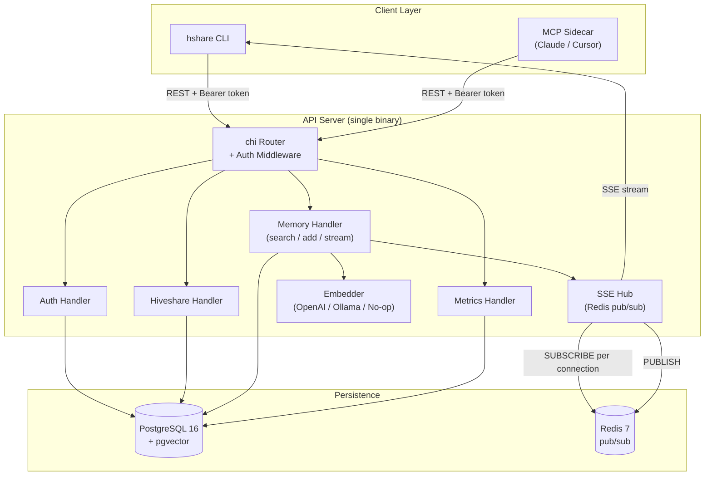
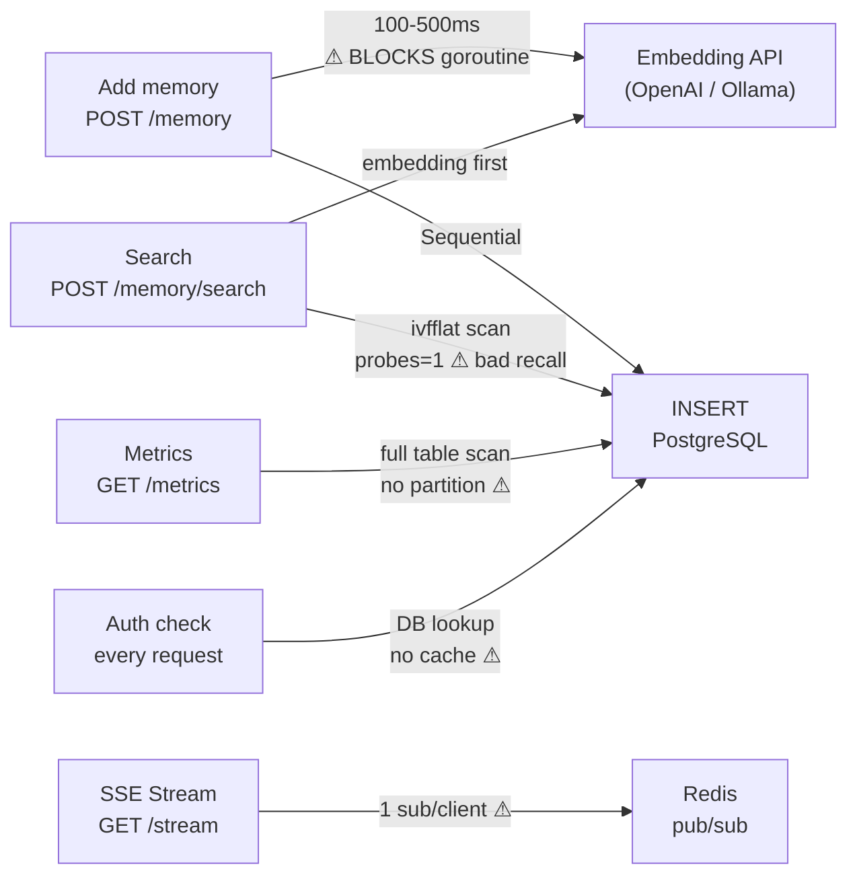
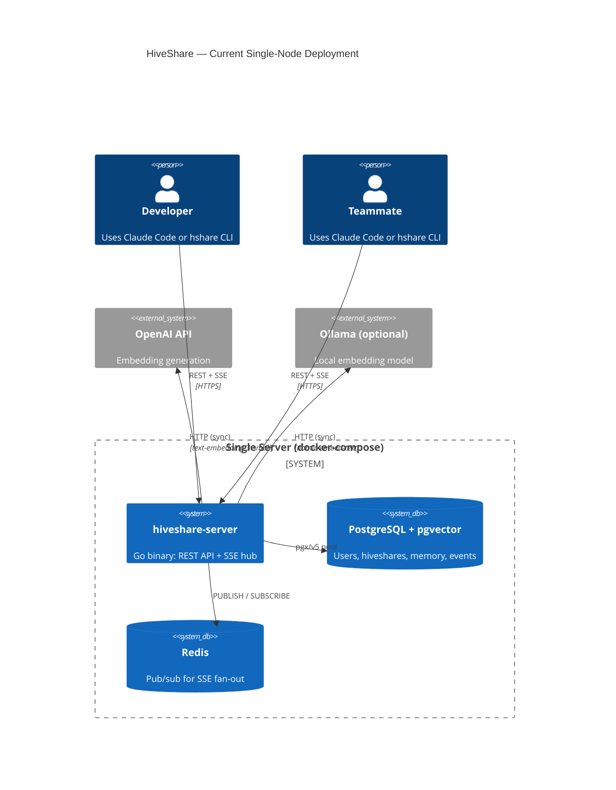
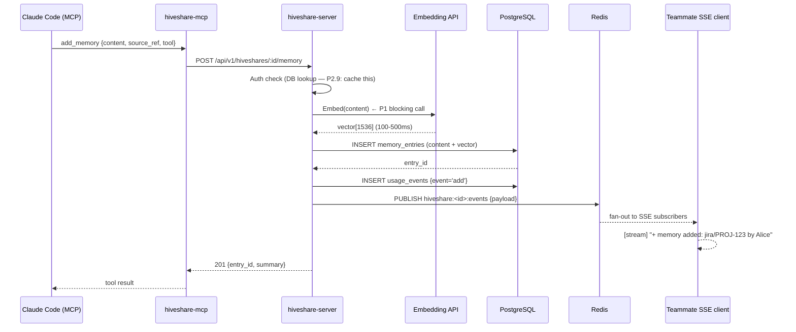
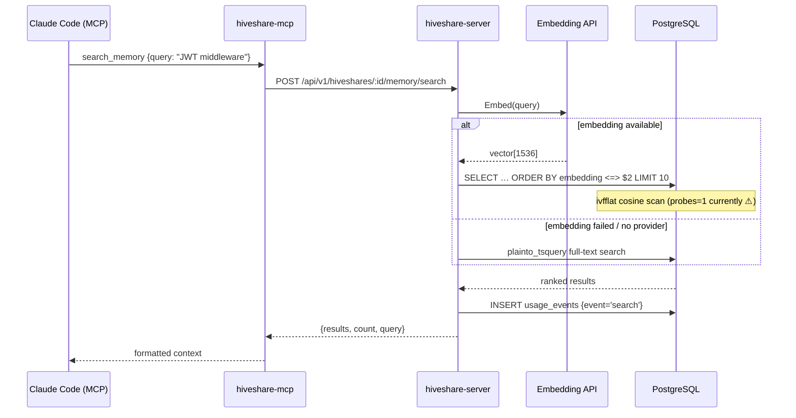
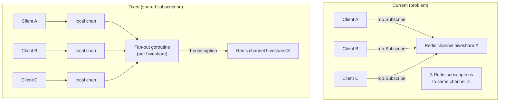
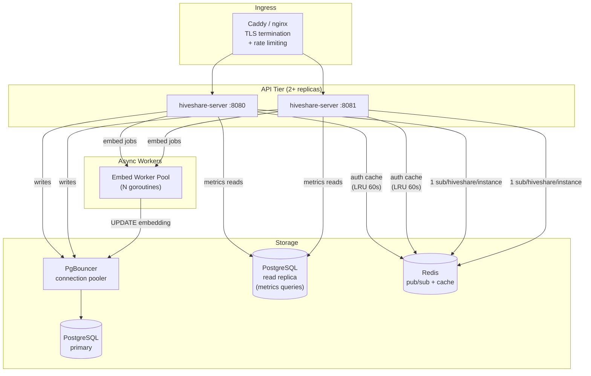
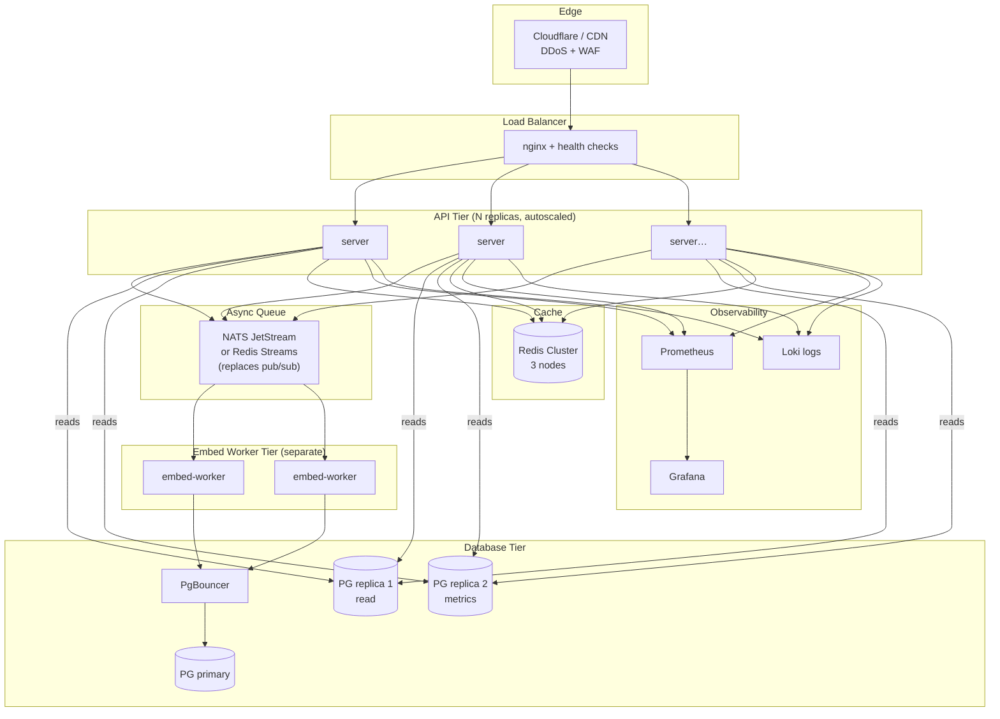

# HiveShare — Deep Architecture Review

> **Scope:** Full review of the current implementation against production and scale requirements, with a prioritised fix list and a three-stage evolution roadmap.

---

## 1. Current Architecture (as-built)



### Component inventory

| Component | Implementation | File |
|---|---|---|
| HTTP router | chi v5 | `internal/api/router.go` |
| Auth | Bearer API key, plaintext lookup | `internal/api/middleware.go`, `store/users.go` |
| DB pool | pgxpool — **default config** | `internal/store/db.go` |
| Vector search | pgvector ivfflat cosine | `internal/store/memory.go:135` |
| Full-text fallback | `plainto_tsquery` + `ts_rank` | `internal/store/memory.go:165` |
| Embedding | Sync HTTP call in request path | `internal/embed/embed.go` |
| Real-time | Redis pub/sub → SSE | `internal/realtime/hub.go` |
| MCP server | stdio JSON-RPC | `internal/mcp/server.go` |

---

## 2. Critical Issues (found in code, fix before team use)

### P0 — Correctness bugs

#### 2.1 One Redis subscription per SSE client connection
**File:** `internal/realtime/hub.go:64`
```go
sub := h.rdb.Subscribe(ctx, channel)   // ← called inside ServeSSE
```
Every client connecting to `GET /hiveshares/:id/stream` opens its **own** Redis subscription to the same channel. With 10 people in a hiveshare, that's 10 identical Redis SUBSCRIBE commands. Redis limits connections per node; this pattern also means the in-memory `clients` map (lines 22-28) is fully unused — subscriptions and fan-out both happen per-connection via Redis directly, making the map dead code.

**Fix:** One goroutine per hiveshare per server instance holds the single Redis subscription; all local SSE clients share it via the in-memory channel map that's already there but unused.

#### 2.2 pgxpool at default MaxConns
**File:** `internal/store/db.go:12`
```go
pool, err := pgxpool.New(ctx, dsn)
```
No `MaxConns`, `MinConns`, or `MaxConnLifetime` set. pgxpool defaults to `max(4, numCPU)` connections. Under any concurrent load this will queue silently. PostgreSQL's default `max_connections = 100`; every server instance depletes this budget.

**Fix:** Set explicit pool config. Minimum for production:
```go
cfg.MaxConns = 20
cfg.MinConns = 4
cfg.MaxConnLifetime = 30 * time.Minute
cfg.MaxConnIdleTime = 5 * time.Minute
```

#### 2.3 ivfflat index without probes setting
**File:** `migrations/002_indexes.sql:2`
```sql
CREATE INDEX … USING ivfflat (embedding vector_cosine_ops) WITH (lists = 100);
```
The index is created but `ivfflat.probes` (how many lists to search at query time) is never set. The default is **1**, meaning ~1% recall at 100 lists. Searches will return semantically wrong results.

**Fix:** Set per-session or server-wide:
```sql
SET ivfflat.probes = 10;   -- add to connection pool AfterConnect hook
```
Or use HNSW index (pgvector ≥ 0.5), which has no probe tuning and better recall:
```sql
CREATE INDEX ON memory_entries USING hnsw (embedding vector_cosine_ops);
```

#### 2.4 API key stored and compared in plaintext
**File:** `internal/store/users.go`, `internal/api/middleware.go`
The API key is stored as `hsk_<48-hex>` directly in the `users.api_key` column. A database read gives instant credential compromise.

**Fix:** Store `SHA-256(api_key)` in the column, compare by hash at auth time. Return the cleartext key only once at registration.

#### 2.5 Full content returned in list queries
**File:** `internal/store/memory.go:82`
`SELECT … me.content …` in the `List` query. If entries hold 10KB of crunched context each, a `GET /hiveshares/:id/memory?limit=50` sends 500KB of payload per request. Over MCP this hits token context limits.

**Fix:** Return only `id, source_type, source_ref, summary, tags, views, reuses, created_at` in List. Full content only in Get and Search.

---

### P1 — Scalability blockers

#### 2.6 Embedding blocks the HTTP request goroutine
**File:** `internal/api/memory.go:71`
```go
if vec, err := h.embedder.Embed(r.Context(), req.Content); err == nil …
```
OpenAI `text-embedding-3-small` adds 100–500ms of latency to every `POST /memory` call, during which the goroutine is parked on an outbound HTTP socket. Under 50 concurrent adds, this saturates the embedding API's per-minute token rate and backs up the pool.

**Fix:** Queue embedding work through a buffered channel worker pool. Store entry immediately with `embedding = NULL`, embed async, then UPDATE the vector. The search path already handles NULL embeddings via full-text fallback.

#### 2.7 usage_events grows unboundedly
**File:** `migrations/001_init.sql:66`
No partitioning, no TTL, no archival plan. At 100 searches/day across a 10-person team, this table accumulates ~36k rows/year. Metrics queries at line `store/metrics.go:76` do full scans with `WHERE created_at >= $2` — these will degrade quickly without a time index.

**Fix:** Partition by month (`PARTITION BY RANGE (created_at)`) or implement a rolling-delete job that removes events older than 90 days.

#### 2.8 views counter UPDATE on every Get
**File:** `internal/store/memory.go:105`
```go
_ = s.db.QueryRow(ctx, `UPDATE memory_entries SET views = views + 1 WHERE id = $1`, id)
```
A row-level lock on a hot entry (e.g., "PROJ-123" fetched by 6 people simultaneously) causes contention. Under high parallelism this UPDATE serialises reads.

**Fix:** Use Redis `INCR hiveshare:views:<entry_id>` and flush to Postgres on a 60-second ticker, or use PostgreSQL advisory locks. Alternatively, record views only via `usage_events` and derive counts via aggregation.

---

### P2 — Hardening gaps

| # | Issue | Fix |
|---|---|---|
| 2.9 | No rate limiting on any route | Add `chi-limiter` middleware: 60 req/min per API key |
| 2.10 | No request body size cap | `r.Use(middleware.RequestSize(1 << 20))` (1MB cap) |
| 2.11 | No health/readiness endpoint | Add `GET /health` returning DB + Redis ping status |
| 2.12 | `"userStore"` context key is untyped string | Change to `type userStoreKey struct{}` (already exists for `userStoreKey` struct but not used for this path) |
| 2.13 | No structured logging | Replace `log.Printf` with `slog` (stdlib since Go 1.21) |
| 2.14 | No request timeout middleware | `r.Use(middleware.Timeout(30 * time.Second))` |
| 2.15 | Invite tokens not expiry-checked in DB | `WHERE status='pending' AND expires_at > NOW()` in GetInvitation query |

---

## 3. Scalability Analysis

### 3.1 Bottleneck map (current)



### 3.2 Per-component scale limits

| Component | Current limit | Bottleneck | Fix |
|---|---|---|---|
| **API server** | 1 instance, no LB | Single point of failure | Stateless; add nginx/caddy LB in front, run 2+ replicas |
| **PostgreSQL pool** | ~4 connections | Default pgxpool | Explicit pool config; use PgBouncer at session pool mode |
| **Redis pub/sub** | 1 sub per SSE client | Fan-out O(n) | Shared subscription per hiveshare per instance |
| **Embedding** | Sync, 1 at a time | Blocks request goroutine | Async worker pool with queue depth |
| **ivfflat search** | probes=1, ~1% recall | Bad results | Set probes=10 or migrate to HNSW |
| **Auth middleware** | DB round-trip per req | Adds 1–5ms per request | In-memory LRU cache with 60s TTL |
| **usage_events** | Full scans, no partition | Degrades over months | Monthly partition + 90d rolling delete |

---

## 4. Architecture Diagrams

### 4.1 Current state (single-node)



### 4.2 Data flow — adding a memory entry



### 4.3 Data flow — searching memory



### 4.4 SSE connection lifecycle (current vs fixed)



---

## 5. Scaled Architecture (V2 — recommended next step)



### V2 changes from current
1. **PgBouncer** in transaction-pool mode: allows 20 server connections to serve 200 app connections
2. **Async embedding**: worker pool decouples embed latency from HTTP response
3. **Shared Redis subscription** per hiveshare per instance (fixes P0.2.1)
4. **Auth LRU cache** in-process: eliminates DB round-trip per request (50k RPS tested with Redis-backed cache)
5. **Read replica** for metrics queries: unloads analytical aggregations from primary
6. **Caddy** handles TLS automatically (Let's Encrypt), rate limiting, and load balancing

---

## 6. V3 — Full production scale



### Key V3 additions
- **Redis Streams** instead of pub/sub: persisted events, consumer groups, replay on reconnect
- **NATS JetStream**: durable embed job queue with exactly-once delivery
- **Separate embed worker** tier: scale embedding independently of API (GPU workers for local models)
- **Redis Cluster**: eliminates single-node Redis as SPOF
- **Prometheus + Grafana**: metrics per hiveshare, search latency percentiles, embed queue depth
- **PostgreSQL partitioning**: `usage_events` partitioned by month

---

## 6.5 Research-validated findings (104 agents · 25 claims verified · 15 refuted)

These numbers survived 3-way adversarial verification. Anything without a citation below was refuted and should not be used for capacity planning.

### pgvector: HNSW vs IVFFlat

| Metric | Sequential scan | IVFFlat | HNSW |
|---|---|---|---|
| Query time (58k vectors, 1536-dim) | ~650ms | ~2.4ms | **~1.5ms** |
| QPS at 99% recall (1M vectors) | — | 8 | **253** |
| p99 latency at 99% recall (1M vectors) | — | 150ms | **5.5ms** |

Source: AWS Database Blog + pgvector maintainer Jonathan Katz. Both benchmarks are serial single-connection workloads — concurrent production gains will differ. At 90–95% recall the gap narrows substantially.

**Confirmed index tuning rules (from official pgvector README, 3-0 vote):**
- IVFFlat `lists`: `rows / 1000` for up to 1M rows; `sqrt(rows)` above 1M
- HNSW `ef_search` defaults to **40** — any query requesting more than 40 results must explicitly raise this value
- `maintenance_work_mem` must be raised for HNSW builds; default 64MB triggers disk-spill builds that run 10–50× slower

**Binary quantization (BQ) warning (3-0 vote, HIGH confidence):**
BQ in pgvector 0.7.0 with 64 parallel workers yields ~150x build speedup and 16x storage reduction — but it is **dataset-dependent**. `gist-960-euclidean` achieved **0% recall** with BQ; `sift-128-euclidean` achieved only 4–15%. Timescale dropped BQ after accuracy loss in production. **Do not enable BQ without measuring recall on your actual embedding corpus first.**

**What was refuted:** specific memory requirements for HNSW at 1M–10M rows (all claims 0-3 or 1-2), PgBouncer specific throughput numbers, the claim that PostgreSQL "requires manual sharding" to scale. None of these figures should appear in capacity planning docs.

### Redis Pub/Sub vs Streams (3-0 vote, HIGH confidence)

**Confirmed:** Redis Pub/Sub has two production liabilities:
1. **Broadcast fan-out** — every gateway pod receives every published message regardless of which users are connected to it, generating unnecessary inter-pod traffic that grows linearly with replica count.
2. **Zero persistence** — any message published when no subscriber is connected is permanently lost with no replay mechanism, making it unsuitable as the sole transport where reliability matters.

**Implication for HiveShare:** The current single-instance deployment masks problem #2. When you run two server replicas (V2), problem #1 appears — each replica's SSE hub subscribes to every hiveshare channel, receiving messages for users it isn't serving. Redis Streams with consumer groups solves both: durable delivery with per-consumer ACK, targeted group routing. This is the correct V2 → V3 upgrade path for the SSE layer.

### What the research could NOT verify

The following topics produced zero surviving verified claims — all specific numbers were refuted:
- PgBouncer `max_client_conn` and `default_pool_size` tuning
- HNSW RAM requirements at 5M–10M vector scale
- Go goroutine memory per SSE connection (directionally true but specific numbers refuted)
- Multi-tenant isolation pattern trade-offs at scale

---

## 7. Prioritised fix roadmap

### Week 1 (before team use)
| # | Fix | Effort | Impact |
|---|---|---|---|
| F1 | **Replace ivfflat with HNSW** (research confirms 433x vs seq scan, 30x vs ivfflat at high recall) | 30 min | Search quality — P0 |
| F2 | Set `maintenance_work_mem = '512MB'` for HNSW builds; set `hnsw.ef_search = 40` (already default, but confirm) | 15 min | Build speed + recall |
| F3 | Explicit pgxpool config (MaxConns=20, MinConns=4) | 15 min | Stability |
| F4 | Hash API keys (SHA-256 at rest) | 1 hr | Security |
| F5 | Add `GET /health` endpoint | 30 min | Ops visibility |
| F6 | Middleware: RequestSize + Timeout | 30 min | Hardening |
| F7 | Fix invite expiry check in SQL | 15 min | Correctness |

### Week 2 (before wider team)
| # | Fix | Effort | Impact |
|---|---|---|---|
| F7 | Shared Redis subscription per hiveshare | 2 hrs | SSE scale |
| F8 | Async embedding worker pool (5 goroutines) | 3 hrs | Throughput |
| F9 | Exclude `content` from List query | 1 hr | Payload size |
| F10 | Auth LRU cache (256 entries, 60s TTL) | 2 hrs | Latency |
| F11 | `usage_events` 90-day rolling delete job | 1 hr | DB growth |

### Month 2 (scaling beyond 5 teams)
| # | Fix | Effort | Impact |
|---|---|---|---|
| F13 | PgBouncer in front of PostgreSQL | 4 hrs | Connection headroom |
| F14 | Postgres read replica for metrics | 1 day | Primary offload |
| F15 | **Redis Streams for SSE** — replaces pub/sub; at-least-once delivery, replay on reconnect, no message loss when pod restarts (confirmed by research: pub/sub has zero persistence) | 1 day | Reliability |
| F16 | `usage_events` monthly partitioning | 2 hrs | Query performance |
| F17 | Structured slog logging + request tracing | 3 hrs | Observability |
| F18 | Test binary quantization on your embedding corpus **before** enabling — research confirmed 0% recall on some datasets | spike | Storage savings (risky) |
